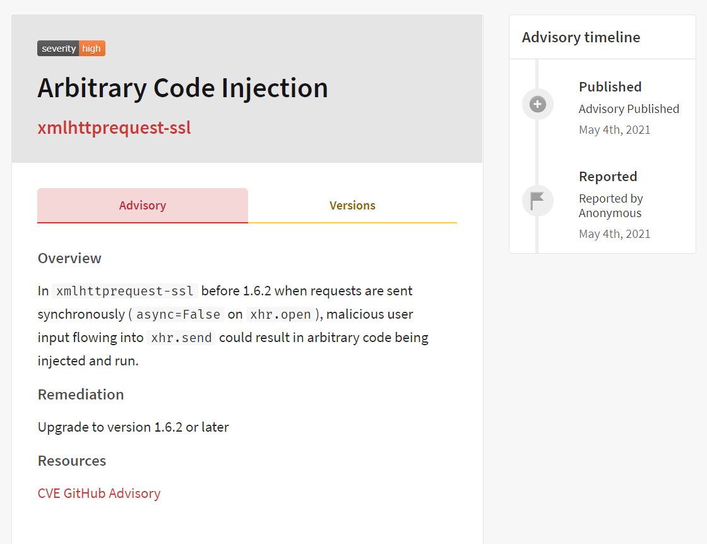
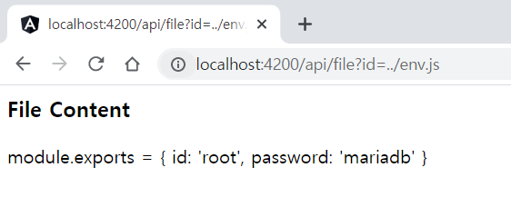

# 1. Cross-site Scripting (XSS)

## 1-1. 사용하지 말아야 할 것

- DOM 직접 조작 (innerHTML 값 수정)
- ElementRef는 보안에 취약한 API로 정의되어 있음

```
Security risk
Permitting direct access to the DOM can make your application more vulnerable to XSS attacks.
Carefully review any use of ElementRef in your code. For more detail, see the Security Guide.

class ElementRef<T = any> {
  constructor(nativeElement: T)
  nativeElement: T
}
```

- 참조 : https://angular.kr/api/core/ElementRef#constructor()

## 1-2. 해결 방안

### 1) Renderer2 사용

### 2) sanitizer

- 뷰에서 잠재적으로 위험한 값을 삭제하는데 사용함
- [innerHTML] 사용하는 경우 Angular 내장 HTML sanitizer에 의해 잠재적으로 안전하지 않은 요소에 대해 제거한다. (`<script>`, `<a>` 의 href 속성)

## 1-3. Sample Code

### 소스 파일

- front-app/src/app/app.componenet.ts

### 코드 수행

- 1. front-app 경로에서 `npm install` 수행 후 `ng serve`
- 2. http://localhost:4000 접속

# 2. Using Components with known vulnerabilities

- 의존하는 라이브러리의 취약성에 대해 주기적으로 검사가 필요함

## 2-1. npm audit

- 감사 명령은 프로젝트에 구성된 의존성에 대한 설명을 기본 레지스트리에 제출하고 알려진 취약점에 대한 보고서를 요청한다.

```
qkdwo@DESKTOP-5LORAO7 MINGW64 ~/work/web-vulnerability/front-app (main)
$ npm audit

                       === npm audit security report ===

# Run  npm install --save-dev karma@6.3.4  to resolve 6 vulnerabilities
SEMVER WARNING: Recommended action is a potentially breaking change

  Low             Prototype Pollution

  Package         minimist

  Dependency of   karma [dev]

  Path            karma > optimist > minimist

  More info       https://npmjs.com/advisories/1179


  ...


                                 Manual Review
             Some vulnerabilities require your attention to resolve

          Visit https://go.npm.me/audit-guide for additional guidance


  Moderate        Regular expression denial of service

  Package         glob-parent

  Patched in      >=5.1.2

  Dependency of   @angular-devkit/build-angular [dev]

  Path            @angular-devkit/build-angular > webpack-dev-server >
                  chokidar > glob-parent

  More info       https://npmjs.com/advisories/1751

found 53 vulnerabilities (2 low, 46 moderate, 4 high, 1 critical) in 1460 scanned packages
  run `npm audit fix` to fix 42 of them.
  10 vulnerabilities require semver-major dependency updates.
  1 vulnerability requires manual review. See the full report for details.

```

## 2-2. npm audit fix

- 프로젝트에서 취약성을 스캔하고 취약한 종속성에 호환 가능한 업데이트를 자동으로 설치

```
qkdwo@DESKTOP-5LORAO7 MINGW64 ~/work/web-vulnerability/front-app (main)
$ npm audit fix
npm WARN karma-jasmine-html-reporter@1.6.0 requires a peer of jasmine-core@>=3.7.1 but none is installed. You must install peer dependencies yourself.
npm WARN optional SKIPPING OPTIONAL DEPENDENCY: fsevents@2.3.2 (node_modules\chokidar\node_modules\fsevents):
npm WARN notsup SKIPPING OPTIONAL DEPENDENCY: Unsupported platform for fsevents@2.3.2: wanted {"os":"darwin","arch":"any"} (current: {"os":"win32","arch":"x64"})
npm WARN optional SKIPPING OPTIONAL DEPENDENCY: fsevents@1.2.13 (node_modules\watchpack-chokidar2\node_modules\fsevents):
npm WARN notsup SKIPPING OPTIONAL DEPENDENCY: Unsupported platform for fsevents@1.2.13: wanted {"os":"darwin","arch":"any"} (current: {"os":"win32","arch":"x64"})
npm WARN optional SKIPPING OPTIONAL DEPENDENCY: fsevents@1.2.13 (node_modules\webpack-dev-server\node_modules\fsevents):
npm WARN notsup SKIPPING OPTIONAL DEPENDENCY: Unsupported platform for fsevents@1.2.13: wanted {"os":"darwin","arch":"any"} (current: {"os":"win32","arch":"x64"})
npm WARN optional SKIPPING OPTIONAL DEPENDENCY: fsevents@2.1.3 (node_modules\fsevents):
npm WARN notsup SKIPPING OPTIONAL DEPENDENCY: Unsupported platform for fsevents@2.1.3: wanted {"os":"darwin","arch":"any"} (current: {"os":"win32","arch":"x64"})

added 3 packages from 38 contributors, removed 1 package and updated 1 package in 6.912s

81 packages are looking for funding
  run `npm fund` for details

fixed 42 of 53 vulnerabilities in 1460 scanned packages
  1 vulnerability required manual review and could not be updated
  3 package updates for 10 vulnerabilities involved breaking changes
  (use `npm audit fix --force` to install breaking changes; or refer to `npm audit` for steps to fix these manually)
```

## 2-3. npm audit 재수행 결과

```
qkdwo@DESKTOP-5LORAO7 MINGW64 ~/work/web-vulnerability/front-app (main)
$ npm audit

                       === npm audit security report ===

# Run  npm install --save-dev karma@6.3.4  to resolve 6 vulnerabilities
SEMVER WARNING: Recommended action is a potentially breaking change

  Low             Prototype Pollution

  Package         minimist

  Dependency of   karma [dev]

  Path            karma > optimist > minimist

  More info       https://npmjs.com/advisories/1179


...


                                 Manual Review
             Some vulnerabilities require your attention to resolve

          Visit https://go.npm.me/audit-guide for additional guidance


  Moderate        Regular expression denial of service

  Package         glob-parent

  Patched in      >=5.1.2

  Dependency of   @angular-devkit/build-angular [dev]

  Path            @angular-devkit/build-angular > webpack-dev-server >
                  chokidar > glob-parent

  More info       https://npmjs.com/advisories/1751

found 11 vulnerabilities (2 low, 4 moderate, 4 high, 1 critical) in 1463 scanned packages
  10 vulnerabilities require semver-major dependency updates.
  1 vulnerability requires manual review. See the full report for details.
```

- moderate 같은 경우에는 건수가 줄어들었지만 나머지는 그대로임
- 해결되지 않는 취약점은 More info 에서 확인 후 수동으로 해결할 필요가 있음
  

# 3. 경로 조작 (시스템자원 접근)

- 공격자가 입력값 조작을 통해 시스템이 보호하는 자원에 접근하여 정보 노출 유발

## 3-1. 입력 정보에 대한 보안

- get 방식을 통해 query 값을 그대로 사용해 파일을 읽는 경우
  ../ 을 이용해 경로 조작이 가능함



## 3-2. path parsing

- `path.parse`를 사용해 객체에서 필요한 파일명만 사용

```
const filter = path.parse(req.query.id);
console.log(filter);

{ root: '', dir: '..', base: 'env.js', ext: '.js', name: 'env' }
```


## 1-3. Sample Code

### 소스 파일

- server.js

### 코드 수행

- 1. front-app 경로에서 `npm run server` 수행
- 2. `http://localhost:4200/api/file?id=../env.js` 접속
- 3. `http://localhost:4200/api/filter_file?id=../env.js` 접속
